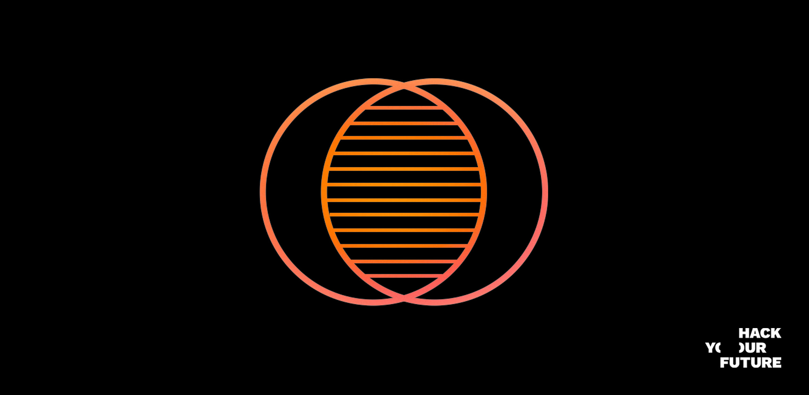
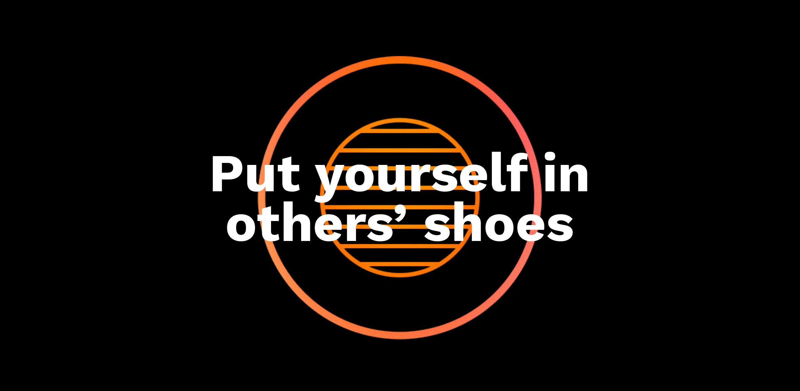
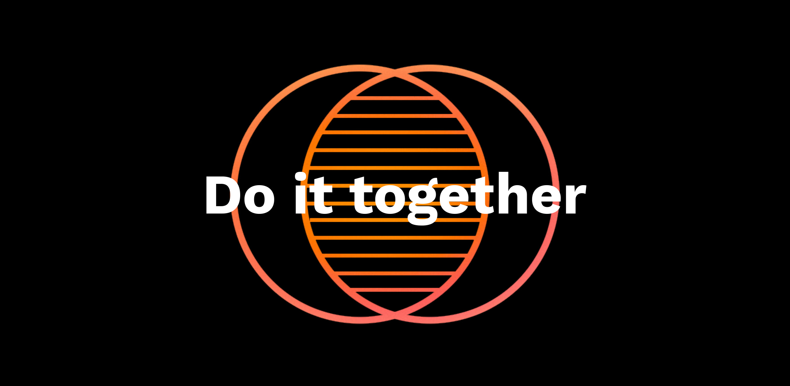
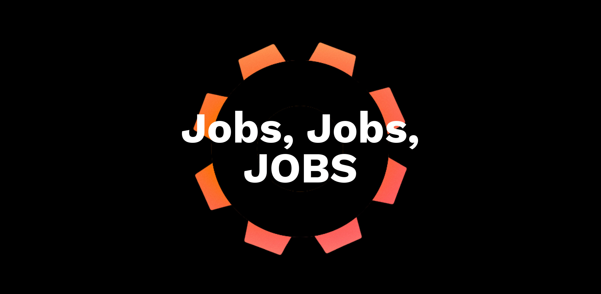

# Our Culture

# Our Mission
Support people with a distance to the labour market find quality employment.

# Our Vision
A world where your drive and potential, not your background, define your career opportunities.

# Our Purpose
No talent goes to waste!

# Our Values
We know that communities and organizations with a strong culture and higher purpose perform better in the long run. This requires a set of clear values. HackYourFuture is built on four core values, which form the ethical framework in which we try to realize our mission. Our core values should guide us all: the core team, mentors and students. The effectiveness of these values depends mostly on the degree to which we hold ourselves and each other accountable and we strive to have them guide all our actions and decisions. Our values provide a clear framework, yet we realize that tensions may arise between values. As such, their prime function is to guide us in a continuous process of reflection and application.

## Respect and Empathy

HackYourFuture was set up with the goal to help talented people use their potential. 
This is partially underpinned by a rational conviction that we are all better off when talent is used in an efficient manner. Unemployment and underemployment of people with skills and motivation hurts all of us. 

But it is not just a pure utilitarian view that drives our organization. We believe in respect and empathy. Empathy helps us to understand that not being able to use your potential is a frustrating experience. From this follows respect, regardless of our different backgrounds and opinions, we respect each other and acknowledge the fact that we are all human beings with challenges and dreams. As such, the ability to put yourself in someone else’s shoes is a fundamental value of our organization. Therefore, we believe it should guide our daily operations as well, for staff, mentors and students.

For instance, empathy and respect helps us to understand the extraordinary efforts by HYF’s mentors. They volunteer their free time, free-of-charge. Time they could otherwise spend working or with their families and friends. By implementing their feedback from code reviews, preparing for lectures, asking questions etc., students show to value their time. 

In turn, mentors put themselves in the shoes of students, who often hold limited to no experience in coding and try to relate to their level of knowledge as much as possible when providing support. 
The core team attempts to understand the challenges HYF students go through, often working from an AZC or dealing with the pressures from a client manager. The team is sensitive to these challenges, as long as they are communicated well.

### Some more example include:
- Students thanking their mentors after class and writing a detailed response to feedback they received on their code. 
- The core team is flexible with ‘the 3-strike rule’ (see Student Manual) in the case a student  needs to prepare for interviews with the IND (Dutch Immigration Services) 
- Students respect their classmates and understand they go through stressful times. They try to help out when needed and work in a collaborative manner during the complete HYF program.

## Communication and Collaboration

HYF is only possible because of collaboration. We have a small core team and rely heavily on the contributions of our mentors and the efforts of students. Also within classes collaboration is key. Students will need to ask their classmates for help. Not only will you solve technical challenges, learning how to collaborate and communicate is part of being a successful developer and helps to get and keep an internship/job. To facilitate decent collaboration, professional communication is pivotal. Communication among students, with mentors but also with and within the core team. 

### Some examples include:
- Some mentors have facilitated the hiring of HYF students in companies they work for or have in their networks.
- Students from class28 shared their personal feedback from practice interviews with Adyen with their classmates to help them prepare.
- Merve (class 28) connected with the teachers that corrected her homeworks for a final round of feedback.
- Unmesh offered Fede a lesson on Git to better collaborate on the online curriculum.
- Many students help out their classmates when they have finished their homework.
- Multiple students have created PRs/issues to improve the content of our curriculum.

## Drive & Pro-activity

HYF students might not have a lot of experience with coding, but their sheer commitment is what sets them apart and renders it a valuable investment for a company. This commitment is based on one’s drive (the ability to motivate yourself and keep working) as well as pro-activity (doing more than is expected of you). Our education program is completed based on this value, with a clear focus on self-study and self-awareness. There is a clear infrastructure of support by way of the curriculum, the core team and the mentors. But students need to put in most of the effort to reach their goals. We typically estimate the weekly commitment to HYF for students at ~40 hours. But if this is your chance to take back control over your life, maybe more is needed. 

The examples below show that other community members aim to apply these values as well:

- HYF graduate Talip (class 22) preparing a full-on branded application to impress a recruiter when this was not expected (and getting the job of course!).
- Aleks (student class 29) built a domino game application as an extracurricular activity next to his regular homework as he wanted to be challenged more, learn faster and have more to show on his CV.
- Mentor Stas reviewed all JS tests for class 28 in one evening (when he was expected to review 4 only).
- Mentor Andrej hosted a meeting after a test to answer students’ questions on his own initiative.
- Fede and Wouter worked on the [Behind the Source](https://www.hackyourfuture.net/behindthesource/) promo campaign for HYF after work hours.
- Our mentor Riccardo created a great [checklist for graduates working on technical assignments](https://github.com/riccardobevilacqua/technical-assignment-tips) without being asked for.
- Our mentor Unmesh not only volunteers to teach for HYF Netherlands, but in HYF Belgium and Denmark as well.

## Results Oriented and Accountability

In a way, coding is just a means to an end. Becoming a good coder will hopefully lead to a good job and a better life. Therefore, at HYF, everything we do is with this goal in mind. It is also what sets us apart from many programs that focus on training only (often with limited sustainable impact).

For this reason we try to run HYF as much like a company with a professional environment. We therefore constantly evaluate the invested time of the core team and assess whether their efforts lead to a higher chance of placement of students. It is also why we expect students and mentors to participate in HYF in a professional manner. To see it as a job, instead of a hobby.

### Some examples include:
- We have a strict selection process. We receive ~200 applicants for a new class, yet not more than 15 applicants are selected. While we strongly believe everyone deserves a fair chance, we set these criteria because after 7 months of studying, students need to have a realistic chance at finding a high-end job in tech.
- Our curriculum consists of homework assignments, practice interviews and technical and soft skill tests to ensure students are ready for graduation and the job market.
- We maintain a 3 strikes out policy to keep everyone sharp and accountable. Missing a class or deadline and not communicating properly will lead to 1 strike. 3 strikes are usually a clear sign that you don't or cannot live by the values that help our community deliver on our mission.
- HYF graduate Mehmet Bozdemir making a daily schedule and putting in more than 50 hours a week.
- Our curriculum is continuously updated to make sure the technologies and frameworks we teach are in line with the demands of the labor market.

#### If you are a new student at HackYourFuture, do not forget to also check the [different common scenarios](https://github.com/HackYourFuture/culture/blob/main/scenarios.md) you might encounter during your time with us, and how to go about them.  
